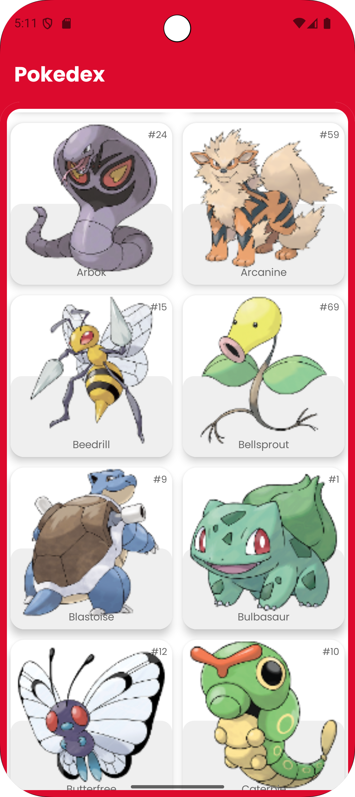

**MyPokedex** — Android-приложение-покедекс на Kotlin с современным стеком Jetpack.
Проект получает данные о покемонах из API, хранит их локально и отображает список с пагинацией и экраном деталей.




## 🚀 Основные возможности

- Список покемонов с постраничной загрузкой (Paging 3)
- Экран детальной информации о покемоне
- Локальное кэширование данных через Room
- Работа с сетью через Retrofit + OkHttp
- Асинхронная логика на Kotlin Coroutines
- Загрузка изображений через Coil

## 🧩 Технологии

- **Язык:** Kotlin
- **UI:** Jetpack Compose, Material 3, Navigation Compose
- **Архитектура:** MVVM 
- **DI:** Koin
- **Сеть:** Retrofit, Gson Converter, OkHttp
- **База данных:** Room
- **Пагинация:** Paging 3
- **Асинхронность:** Kotlin Coroutines
- **Изображения:** Coil
- **Тестирование:** JUnit 5, MockK, Coroutines Test
- **Сборка:** Gradle (KTS), Android Gradle Plugin, KSP

## 🗂️ Структура проекта

```text
app/src/main/java/tymora/myPokedex/
├── data/          # Источники данных, Room, Retrofit, репозитории, мапперы
├── domain/        # Доменные интерфейсы
├── di/            # Модули зависимостей (Koin)
└── ui/            # Экраны, компоненты, темы, ViewModel
```